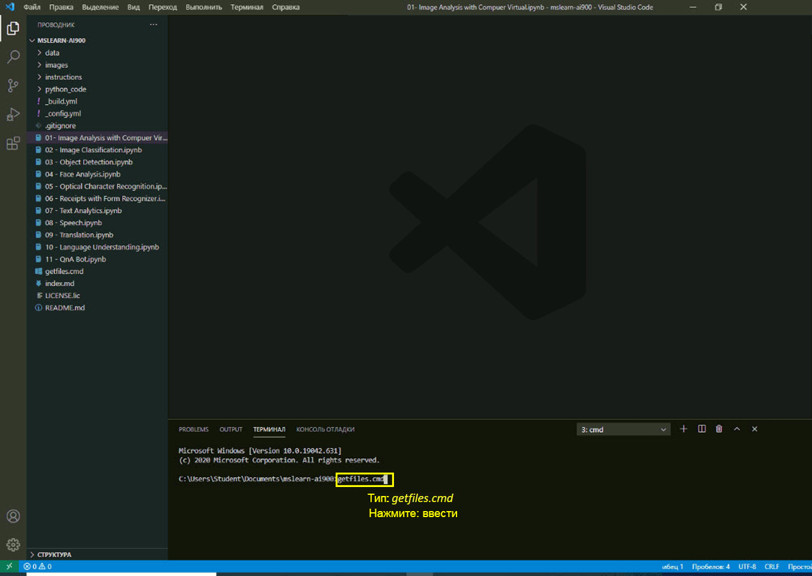

---
lab:
    title: 'Анализ квитанций в распознавателе документов'
---

# Лабораторные задания AI-900
## Получить самые актуальные файлы

1.  Запустите Visual Studio Code (значок программы закреплен на нижней панели задач). При открытии на панели слева должен появиться проект MSLEARN-AI900.

2.  Мы получим самую актуальную версию проекта. В открытом окне терминала введите +++getfiles.cmd+++ и нажмите **ввод**. Эта команда получает самую актуальную версию проекта в вашу папку. 
3.  После выполнения команды можно закрыть терминал. Теперь можно приступить к лабораторной работе. 

На этом лабораторном занятии мы воспользуемся службой распознавателя документов в Azure для идентификации текста на изображениях документов.

-  Откройте записную книжку **06 - Receipts with Form Recognizer.ipynb** в Visual Studio Code. 
    **Примечание.** Может появиться запрос на заполнение 2-минутного опроса. Выберите **Нет, спасибо**. Необходимо сделать это несколько раз.
-  Выполните инструкции в записной книжке для выполнения этого лабораторного задания.
